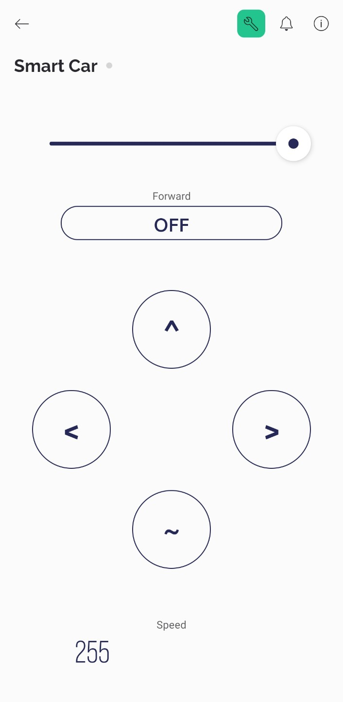

# Wifi Controlled Robot

### What is Wifi Controlled Robot

- A WiFi-controlled robot allows remote operation via wireless networks using smartphones, tablets, or computers. Commands are transmitted through apps or web interfaces, enabling tasks like movement and interaction. Applications range from education to industrial automation. Challenges include network reliability and security. Advancements in AI and connectivity hold promise for future development, such as integrating advanced AI capabilities and improving network stability.

### Pre-Requisites Softwares
- Arduino IDE
- Blynk

### Components Required
- NodeMcU
- Switch
- DC Motors
- Motor Driver
- Power Supply

### Circuit Diagram

    
    
<em>Circuit Design</em>

### Blynk Interface

    

### Car 

    
    

